We recently built a #lockdownwall 

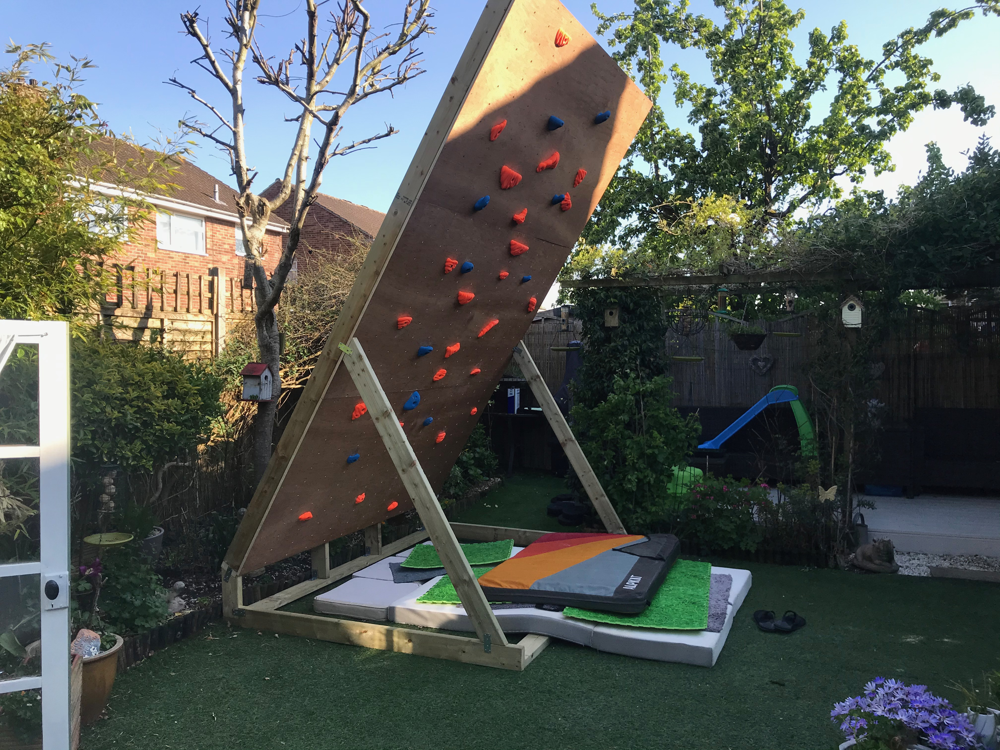

Heres how we did it:

# Finding a design

I had a couple of constraints I needed to work with

1. It shouldn't take up too much of the garden
1. It must not cast a shadow on the seating area
1. It can't look too ugly
1. It isn't going to be permanent (no cementing posts)
1. It needs to not fall apart the first time it rains

Using the [moonboard dimensions](How-to-build-a-MoonBoard.pdf) for the 25° & 40° walls I tried to get an idea of how much space they would actually take up

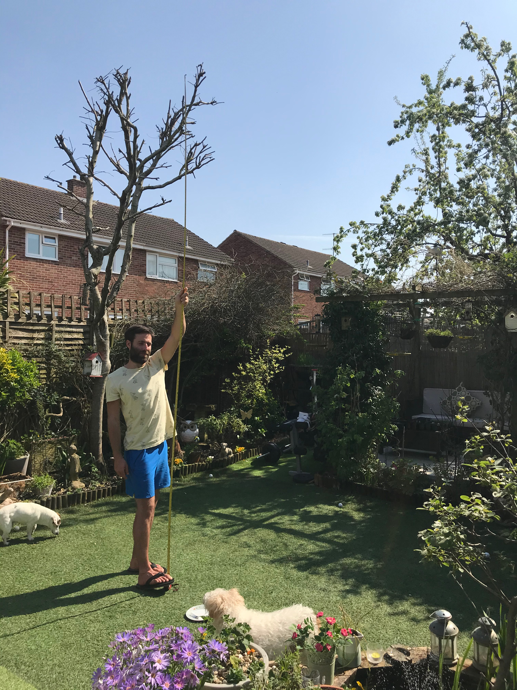

I ended up settling on 30° as a compromise between height and depth the wall would 
take up. 

40° meant the landing area would be too large due to the additional swing you can generate on steeper walls.

After much googling for other peoples designs I found a couple that might work and mocked them up in SketchUp.

## Validating the design

To see what this was going to look like I first took a photo of the garden

Then using [Fspy](https://fspy.io) I was able to import the photo and my SketchUp model into [blender](https://www.blender.org) to get an idea of how things would look fully assembled:

## Finding materials

The only places not affected by the lockdown which I could get the timber and plywood from were Wickes and B&Q, what they had available meant I would need to change my design a little.

It also meant I wouldn't be able to get the plywood for a _week_ as B&Q were soo busy.

Holds are in short supply right now but we managed to get some *super* quickly from [Holdz](https://www.holdz.co.uk) (the ones you can see in the pictures) and have 70 more coming in two weeks from [Climbing Holds](http://climbingholds.shop/)

## Construction

The first thing I did was cut all of the timber

I made the first cut with a jigsaw and regretted it, even with the jig the cut was not straight as the bottom of the blade had moved around, leaving me with an uneven surface.

I have a [tenon saw](https://en.wikipedia.org/wiki/Backsaw) which I used to hand cut the rest of the timber.

I had anticipated at least one botched cut and I could re-use the timber for the horizontal brace for the base by making another cut 90mm further down.

Next, by far the most tedious part was marking then drilling holes for the t-nuts.

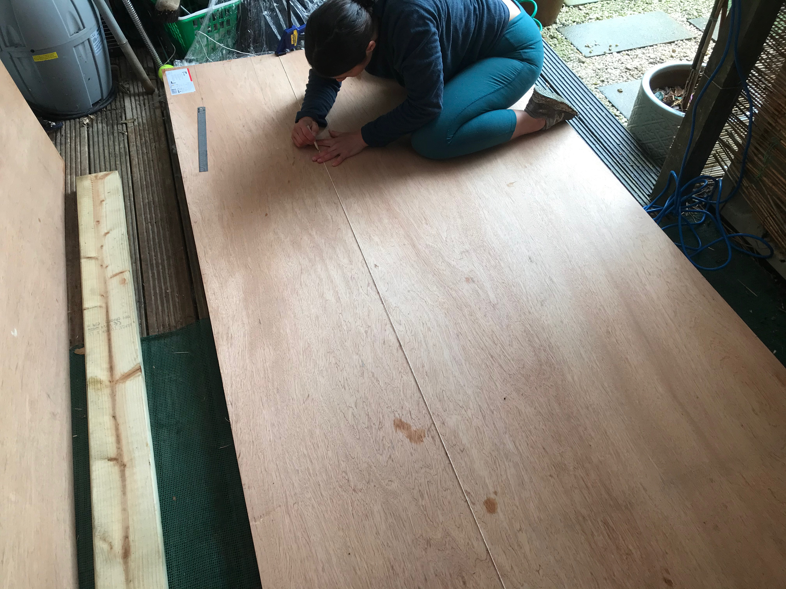

We used some string which we tensioned with clamps to evenly space the marks.

First one axis, then the other leaving us with a nice grid of `+` marks.

After watching us do this my brother informed me we could have used a tool called a chalk line to do this much more quickly.

Look who saved £6.

To speed up the drilling we stacked the three panels and clamped them.

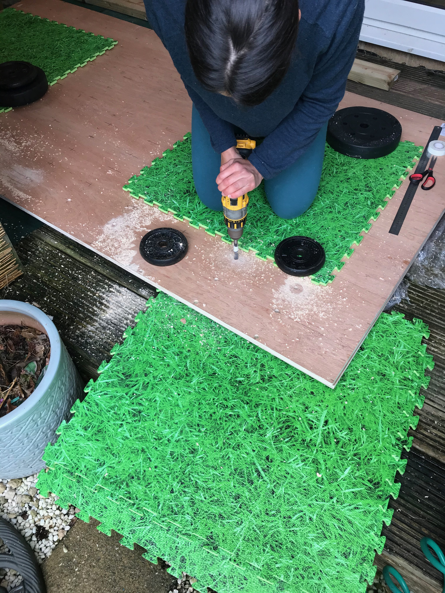

Taking it in turns to do 3 rows of holes we ended up with a good result.

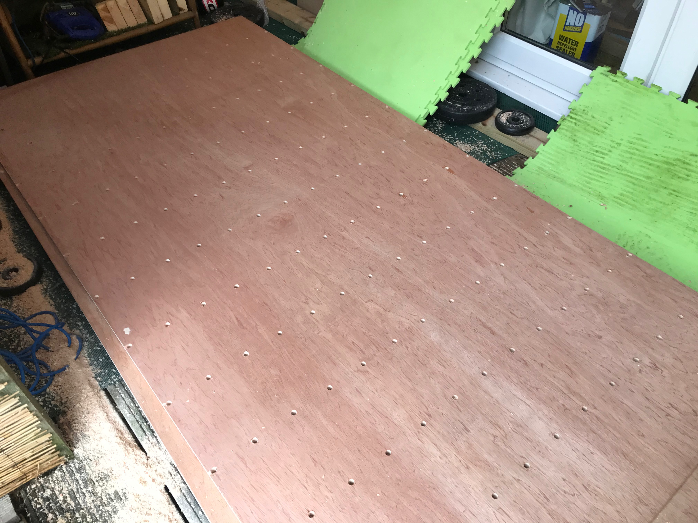

Next we assembled the frame the plywood will be attatched to

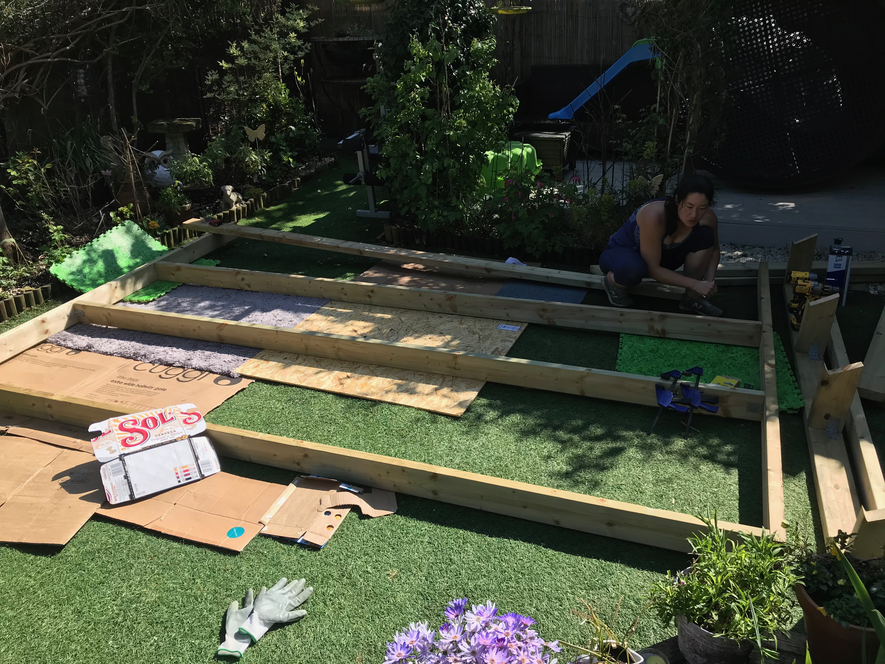

This was a bit more difficult than it needed to be thanks to the warped timber Wickes had given us.

This (and all the cardboard scraps) gave us a place to treat the plywood.

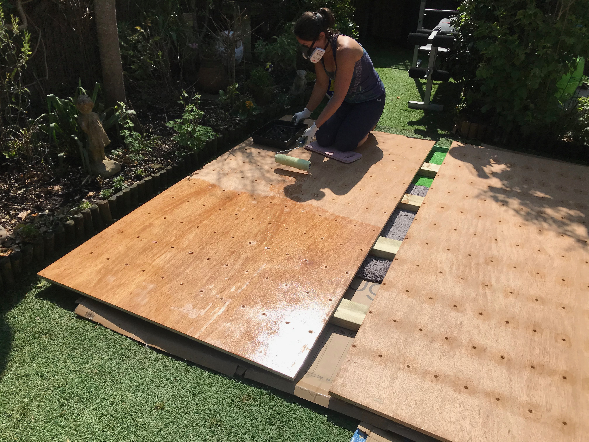

## Assembly

While the varnish was drying we assembled the kickboard

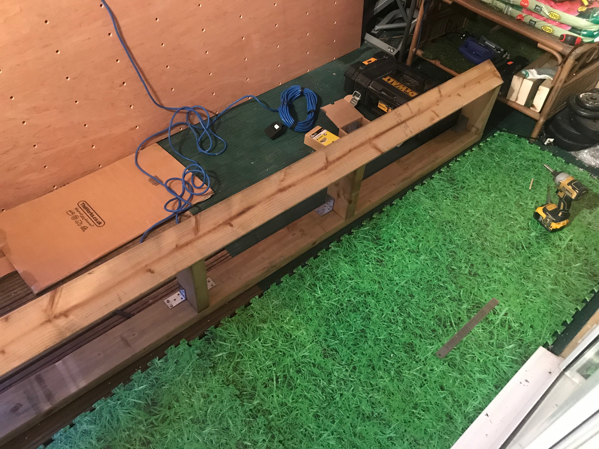

and the stand

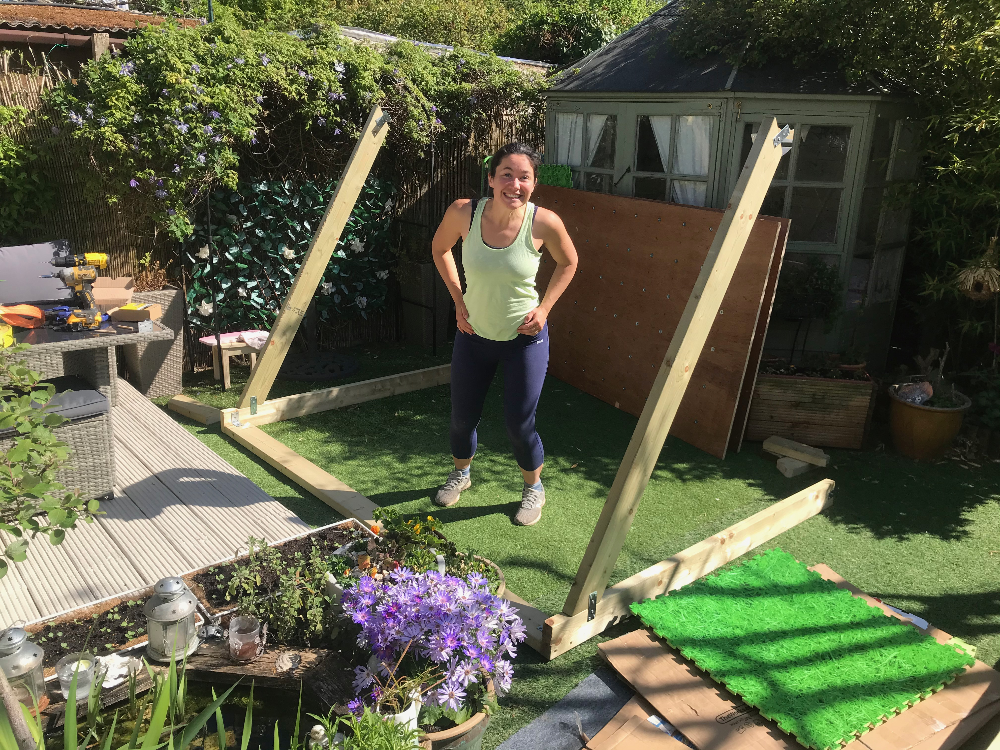

Then once the varnish was dry we could attatch the kickboard the the main frame

Originally we had attatched all 3 of the plywood panels to the frame, but this 
was going to be two heavy for just two people to support whilst we attatched the stand.

We realised the design only meant the middle panel needed to be attatched, and without the top and bottom it was much lighter. 

Then we only needed to screw the top and bottom panel back in

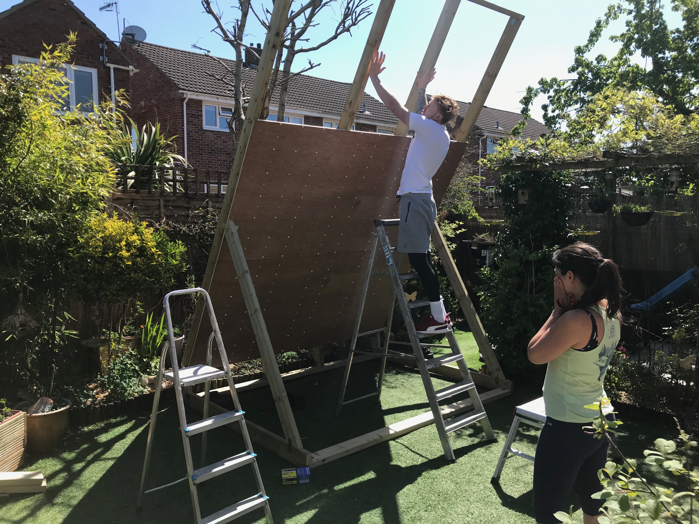

## Weather proofing

The timber is preassure treated and suitable for ground contact and the plywood is rated for exterior use, has had the edges sealed and has had 2 coats on the rear and one coat on the front.

The screws penetrate the rear of the wall making it a bit of a waste of time to treat the rear so thoroughly, as the screws will allow the water in anyway.

We brought a tarpaulin which we can fix to the rear which can cover the entire board for rainy weather.

## Wastage

I tried to minimise the number of cuts we needed to make, which meant less labor and minimal wastage.

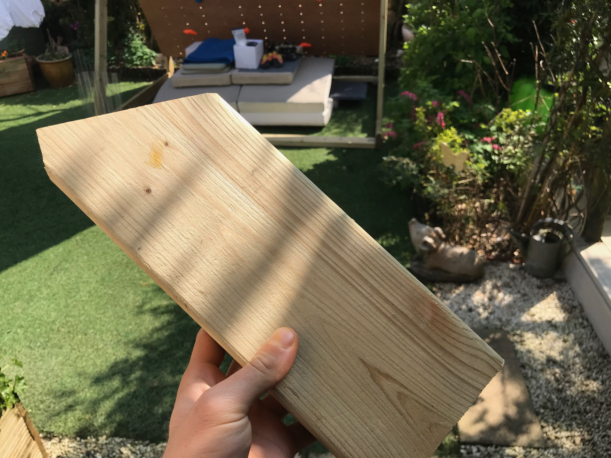

After the frame was cut we did have some offcuts though, which we shaped, sanded and drilled to turn into some additional holds

# Costs

| Material | Dimensions | Quantity | Cost |
| --- | --- |  --- |  --- |
| Plywood | 2440x1220x18 | 3       | £102 |
| Preassure treated timber | 45x120x3600 | 6 | £76 |
| Preassure treated timber | 3000x45x120 | 4 | £42 |
| Preassure treated timber | 2400x45x120 | 2 | £17 |
| Screws | 40x5mm | 400 | £8.20 |
| L-Brackets | N/A | 25 | £13 |
| Plates |  N/A | 10 | £3.50 |
| T-Nuts | M10 | 200 | £15 |
| Countersunk bolts | M10  | 200 | ??? |
| Varnish | 5L   | 1 | £20 |
| Tarpaulin | 4x5m | 1 | £25 |

The wall cost £321, we spent £151.23 at Holdz and £354.80 at ClimbingHolds on holds and bolts which gave us a total cost of __£827__.

In total I spent a day researching and designing the frame, then two of us spent two days assembling everything.

Tools used
- Tenon saw
- Drill
- Impact driver
- Paintbrush
- Sander
- String
- Ruler

# What would I do differently

## Deal with the flex

The board flexes a little near the top of the wall. I would consider using thicker timber (145mm?) on the frame or just addng vertical supports which connect at the top (but would look much uglier).

## Use better quality plywood

The stuff we ended up with was ok given we had no other options, and it looks nice enough but the veneer is wafer thin so any damage shows *very* easily. 

## Pick the timber and plywood in person

Some of the timber is not the best, either being warped or having splits and cracks and the ply came pre-marked.

Overall I am super happy with how things have turned out so far.